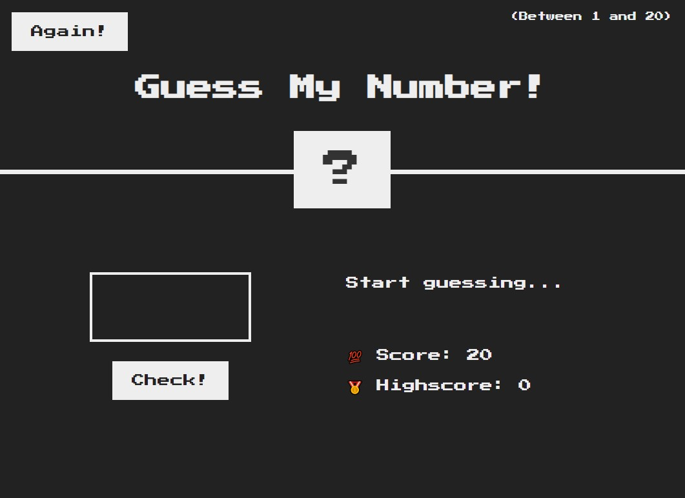
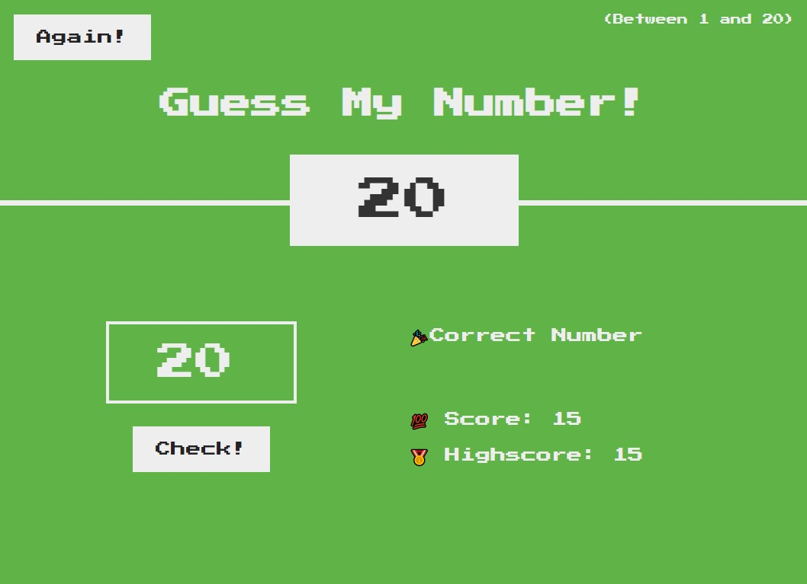

# App - Guess My Number

[This project](https://gurhanalan.github.io/JS-SmallProjects-GuessMyNumber/) is a one-page website where user tries to guess a number between 1 to 20.

## Table of contents

- [App - Guess My Number](#app---guess-my-number)
  - [Table of contents](#table-of-contents)
  - [Overview](#overview)
    - [The challenge](#the-challenge)
    - [Screenshots](#screenshots)
    - [Links](#links)
  - [My process](#my-process)
    - [Built with](#built-with)

## Overview

### The challenge

Users should be able to:

- View the optimal layout for the app depending on their device's screen size
- See hover states for all interactive elements on the page
- Guess a number between 1 to 20.

### Screenshots

 
 

### Links

- Solution URL: [Live Website](https://gurhanalan.github.io/JS-SmallProjects-GuessMyNumber/)

## My process

### Built with

- Semantic HTML5 markup
- CSS custom properties
- CSS Flexbox
- Desktop-first workflow
- Javascript
